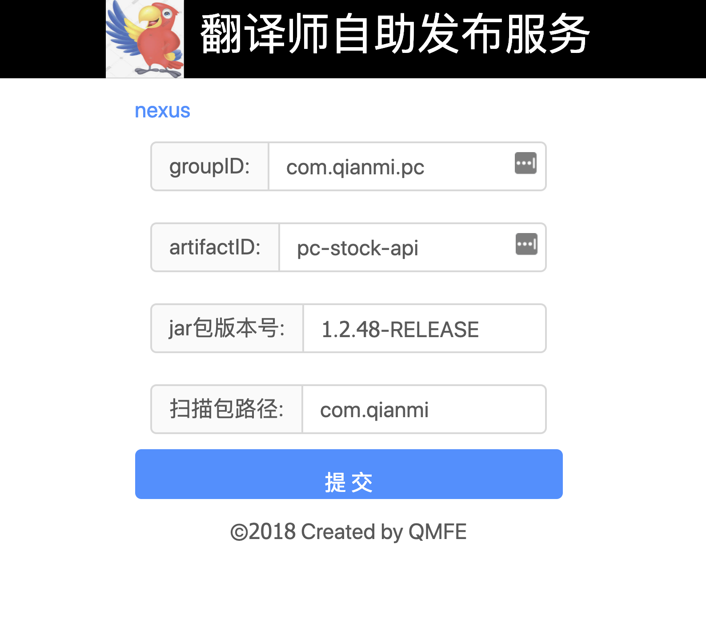

# auto-translator
翻译师. 自助版本.

## what: 是什么
在dubbo2js中引用java jar,[包含四步](http://dubbo.io/dubbo2.js/docs/interpret.html):

1. 从 java Api项目生成jar -- mvn package;
2. 在java Api项目安装mvn相关依赖 -- mvn install dependency:copy-dependencies;
3. 开始翻译生成typescript -- interpret -c dubbo.json;
4. 把生成的ts发布到npm私服 -- npm publish

那么, 能否把这个服务标准化,让开发者简简单单,点一个按钮就把这事办了.

## how: 怎么实现

开发人员的交互窗口,就是一个表单信息, 开发人员把nexus中jar包相关的信息(groupID,artifactID,version)关联起来,点击开始按钮,再等待片刻即可;

那么后端做了什么事.  细分下来, 跟上面的流程基本一致;

1. 根据提供信息从nexus中下载jar包解压;
2. 根据pom信息, 安装依赖  -- mvn install dependency:copy-dependencies;
3. 自动生成dubbo.json文件, 并开始翻译生成typescript -- interpret -c dubbo.json;
4. 把生成的ts发布到npm私服 -- npm publish;
5. 将npm版本号返回给用户,供用户使用;

## TODO: 还需要完善的地方
[]: 与jar包发布同步起来
[]: 自动从nexus中读取提示信息
[]: 把nexus npm 服务配置化;

## FAQ: 常见问题

### 同一版本重复发布? 该引用 的版本号

第一次发布版本号, @qianmi/qm-self-order-api@1.2.47-RELEASE, 后面再发布会追加尾号@qianmi/qm-self-order-api@1.2.47-RELEASE-1

